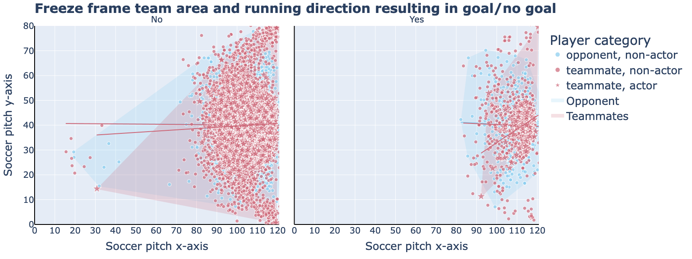

# TheSet-PieceCoach

An analysis of football data to improve corner kick strategies.

This analysis uses the public and free [StatsBomb](https://github.com/statsbomb/open-data/tree/master) football dataset to make recommendations to a Set-Piece coach. These recommendations refer to both defensive and offensive strategies for corner kicks.

An example of this can be found in the following illustration:



## Dataset

The data is provided as JSON files exported from the StatsBomb Data API, in the following structure:

* Competition and seasons stored in [`competitions.json`](https://github.com/statsbomb/open-data/blob/master/data/competitions.json).
* Matches for each competition and season, stored in [`matches`](https://github.com/statsbomb/open-data/blob/master/data/matches). Each folder within is named for a competition ID, each file is named for a season ID within that competition.
* Events and lineups for each match, stored in [`events`](https://github.com/statsbomb/open-data/blob/master/data/events) and [`lineups`](https://github.com/statsbomb/open-data/blob/master/data/lineups) respectively. Each file is named for a match ID.
* StatsBomb 360 data for selected matches, stored in [`three-sixty`](https://github.com/statsbomb/open-data/blob/master/data/three-sixty). Each file is named for a match ID.

The data set contains information about the competitions, season, individual matches with their results, up to the line-up of both teams.

Furthermore, the data set is continuously maintained in the area of a 360 data record and contains detailed information on which events in a game, such as the tackling of a player, through to the position data of a player and what activity he was involved in during an event.

## Analysis

The analysis is in the file: `Football_analysis.ipynb`

Der Gleiche Inhalt mit Bereitstellung der interaktiven Visualisierung findet sich in der `Football_analysis.html`.

## Installation

The conda environment with which this analysis was performed can be generated with:

```bash
create --name <env> --file requirements.txt
```

All necessary dependencies are listed in [`requirements.txt`](https://github.com/statsbomb/open-data/blob/master/data/competitions.json).
